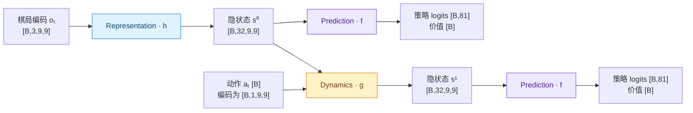
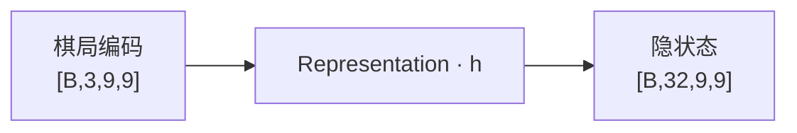
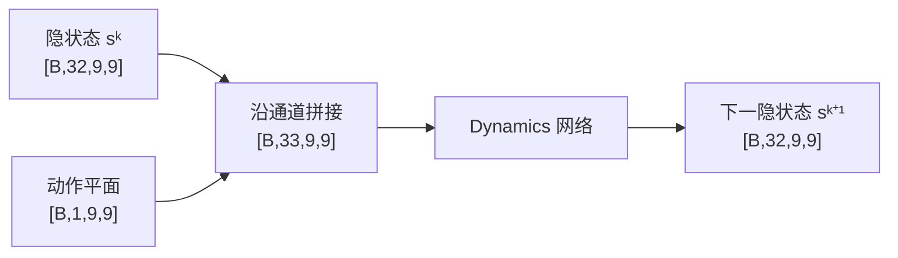
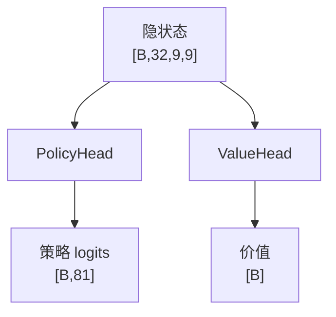
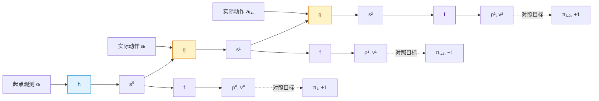

# MuZero（适用于棋类）

**MuZero** 和 AlphaZero 一样，通过**自对弈 + MCTS + 神经网络训练**学习下棋。理解它时，可以先从 AlphaZero 中替换掉一行代码：

```python
# AlphaZero：按照真实规则，算出走完这一步后的棋盘
next_state = game.get_next_state(state, action, to_play)

# MuZero：用神经网络，算出走完这一步后的内部特征
next_hidden_state = model.dynamics(hidden_state, action)
```

AlphaZero 搜索树里的节点保存**真实棋盘**，MuZero 搜索树里的节点保存**隐状态（hidden state）**。这个隐状态就是一个特征张量，后面所有模拟都在这些特征上继续计算。

本文先讲双人轮流落子、零和、没有中间得分的棋类：`to_play = 1` 表示黑方，`-1` 表示白方，value 始终从**当前节点轮到走棋的一方**来看，赢为 `+1`，输为 `-1`，和棋为 `0`。

这里先省略 reward 分支，把最终胜负交给 value 学习。原论文的无中间奖励棋类实验也省略了 reward prediction loss；通用 MuZero 的 reward 分支在后文单独说明。这样可以先看清楚：**即使没有 reward loss，dynamics 也能训练。** [原论文，附录 G](https://arxiv.org/html/1911.08265v2#A7)

## MuZero 的三个神经网络模块

### 先看 hidden state 的形状

**在原论文的棋类实现中，hidden state 的长宽确实与棋盘相同，通道数为 256。** 例如，忽略 batch 维度后，围棋是 `[256, 19, 19]`，国际象棋是 `[256, 8, 8]`，将棋是 `[256, 9, 9]`。这是网络架构的选择，MuZero 算法本身并不要求隐状态一定保留棋盘长宽。[原论文，网络输入与架构](https://arxiv.org/html/1911.08265v2#A5)

为了把尺寸写得具体，下面统一用**本项目五子棋入口的配置：9×9 棋盘、32 个隐状态通道，每步选择一个位置落子，没有 pass 动作**：

| 符号 | 含义 | 本文示例 |
|---|---|---|
| `B` | 一批棋局的数量 | 搜索时可取 `1` |
| `H, W` | 棋盘长宽 | `9, 9` |
| `C_in` | 输入棋局编码的通道数 | `3` |
| `C` | hidden state 的通道数 | `32` |
| `A` | 固定动作空间的大小 | `81` |

本文张量维度按 PyTorch 的 `[B, C, H, W]` 顺序书写。`3` 个输入通道、`32` 个隐状态通道是[五子棋训练入口](../MuZero/gomoku/train.py)的配置，不是原论文的固定参数。

### 先看三个模块怎样连接

真实棋局先由 $h$ 编码成隐状态；$g$ 接收隐状态和动作，生成下一隐状态；$f$ 在每个隐状态上预测策略和价值。



图中两个 $f$ **共享同一套参数**。继续模拟时，把 $s^1$ 和下一个动作交给同一个 $g$，无需重新调用 $h$。网络输出的是 logits；softmax 和根节点的合法动作屏蔽放在搜索流程中处理。


可以把 `[32, 9, 9]` 理解成 **32 张叠在一起的 9×9 特征图**。但这些通道不是“第 1 层黑棋、第 2 层白棋”这样预先规定的棋盘层，而是网络自己学出的浮点数特征。

`hidden_state[:, :, row, col]` 取出该空间位置上的 32 维特征。经过多层卷积，这些特征可以包含周围甚至整个棋盘的信息，不能把它直接当成“这个格子上放了什么棋子”。**空间尺寸相同，不代表每个数都有真实棋盘上的明确含义。**

实现中，$h$ 和每次 $g$ 输出的隐状态都会按样本独立归一化：在该样本全部 `C×H×W` 元素上取最小值和最大值，计算 $(s-\min s)/(\max s-\min s)$，使其与动作平面同处于 `[0,1]`。常量隐状态映射为全零，避免除零。该操作保留梯度，训练、串行搜索和批量搜索共用 [network.py](../MuZero/alphazero/network.py) 中的实现。[原论文，附录 G](https://arxiv.org/html/1911.08265v2#A7)

### 1、Representation：真实棋局 → 隐状态

Representation 记作 $h$，负责把当前真实棋局转换成隐状态：

$$
s^0 = h(o_t)
$$

这里 $o_t$ 是时刻 $t$ 的棋局输入，可以包含当前棋盘、历史棋盘和轮到谁走棋等信息；上标 $0$ 表示“从这个真实棋局出发，还没有在模型里模拟任何一步”。

示例中先把真实棋盘编码为三个通道：

```python
observation[:, 0] = 当前玩家的棋子位置    # 有棋子为 1，否则为 0
observation[:, 1] = 对手的棋子位置        # 有棋子为 1，否则为 0
observation[:, 2] = 当前玩家身份          # 黑方时整层为 1，白方时整层为 0

# observation.shape == [B, 3, 9, 9]
hidden_state = model.representation(observation)
# hidden_state.shape == [B, 32, 9, 9]
```

经过 representation 网络后：



注意，这里的“表示”不是一定要把张量变小。这个例子反而增加了通道数，它要做的是**把棋盘编码转换成后续网络适合使用的特征**。

### 2、Dynamics：隐状态 + 动作 → 下一隐状态

Dynamics 记作 $g$，负责在隐状态中“走一步”：

$$
s^{k+1} = g(s^k, a_{t+k})
$$

这里 $a_{t+k}$ 表示在真实时刻 $t+k$ 执行的动作，$s^{k+1}$ 表示从起点累计模拟了 $k+1$ 步之后的隐状态。训练时用真实执行过的动作；搜索时则可以尝试候选动作。

动作要先变成张量。比如五子棋中的动作是“在第 4 行、第 7 列落子”（下标从 0 开始），可以编码成一张只有落子位置为 `1`、其余位置为 `0` 的特征图：

```python
action_plane = zeros(B, 1, 9, 9)
action_plane[:, 0, 4, 7] = 1        # 此处假设这一批都演示相同动作

# 沿通道维拼接，不是把两个张量相加
x = cat([hidden_state, action_plane], dim=1)
# [B, 32, 9, 9] 与 [B, 1, 9, 9] 拼接 → [B, 33, 9, 9]

next_hidden_state = dynamics_body(x)
# [B, 32, 9, 9]
```

对应的形状变化是：



Dynamics 只接收隐状态和动作，不额外输入 `to_play` 平面，与论文描述一致。根观测仍编码当前玩家，$h$ 将其纳入隐状态；$g$ 通过训练学习保留和更新玩家信息。搜索节点保留 `to_play` 作为视角元数据，实际对局和价值回传继续遵循交替玩家约定。真实棋局终止也不意味着隐状态停止变化。[原论文，附录 E](https://arxiv.org/html/1911.08265v2#A5)

输入和输出的隐状态形状相同，因此可以连续调用**同一个 dynamics 网络**：

```python
s0 = model.representation(observation_t)
s1 = model.dynamics(s0, action_t)
s2 = model.dynamics(s1, action_t_plus_1)
s3 = model.dynamics(s2, action_t_plus_2)
```

`s1`、`s2`、`s3` 都是 `[B, 32, 9, 9]`，但内容不同，分别表示模拟 1、2、3 步后的局面特征。**这里没有先还原成棋盘，也没有重新调用 representation。**

动作通道数取决于游戏。落子游戏可以用一个位置通道；移动棋子的游戏还要表达起点、终点、升变等信息。一般写成：`[B, C + C_action, H, W] → [B, C, H, W]`。

### 3、Prediction：隐状态 → 策略和价值

Prediction 记作 $f$，作用与 AlphaZero 的策略、价值预测相似，只是输入换成了 hidden state：

$$
p^k, v^k = f(s^k)
$$

```python
policy_logits, value = model.prediction(hidden_state)

# hidden_state.shape  == [B, 32, 9, 9]
# policy_logits.shape == [B, 81]
# value.shape         == [B]
```

$f$ 从 hidden state 出发，分成 PolicyHead 和 ValueHead 两条支路；两个 head 内部的具体层本文不展开：



- **Policy**：81 个动作各有一个 logit，经过 softmax 后得到先验概率。动作编号 `row * 9 + col` 对应一个落子位置。网络始终输出完整的 81 项，不在 hidden state 上判断哪个位置可以落子。
- **Value**：每个局面一个标量，表示当前玩家的预期胜负，范围为 `[-1, 1]`。

这三个模块的输入输出可以放在一起看：

| 模块 | 输入 | 输出 |
|---|---|---|
| Representation $h$ | 棋局编码 `[B, 3, 9, 9]` | 隐状态 `[B, 32, 9, 9]` |
| Dynamics $g$ | 隐状态与动作编码拼接后 `[B, 33, 9, 9]` | 下一隐状态 `[B, 32, 9, 9]` |
| Prediction $f$ | 隐状态 `[B, 32, 9, 9]` | 策略 logits `[B, 81]`、价值 `[B]` |

## MuZero 搜索算法流程

和 AlphaZero 一样，走一步棋之前，先进行多次 MCTS 模拟，每次包括**选择、扩展、反向传播**。

但根节点和后续节点的隐状态来源不同：

```python
# 根节点：手里有真实棋局，所以调用 h
root.hidden_state = representation(observation)

# 后续节点：搜索假设动作的结果，所以调用 g
child.hidden_state = dynamics(parent.hidden_state, action)

# 两种节点都用 f 预测策略和价值
policy_logits, value = prediction(node.hidden_state)
```

下面是突出主流程的伪代码，探索系数采用 MuZero 官方伪代码中随父节点访问次数增长的形式，省略批量推理等工程细节。搜索时将网络的 batch 维取出，policy 按动作编号索引，value 作为标量使用。`Node` 默认 `visits=0`、`value_sum=0`、`hidden_state=None`、`children=[]`。`children` 是子节点列表，每个子节点用 `action_taken` 记录对应动作；`value_sum` 存储累计价值，`q_value()` 返回平均价值（未访问时为 0）。下文的 `representation()`、`dynamics()`、`prediction()` 对应 MCTS 中的推理封装，负责张量转换和 batch 维处理，内部调用前面的三个网络模块。

### 1、选择

从根节点开始，选择 PUCT 最大的子节点，直到到达一个未展开的节点：

```python
while node.children:
    node = select(node)


def select(node):
    return max(node.children, key=get_puct)


def get_puct(node, pb_c_base=19652, pb_c_init=1.25):
    # node.value_sum / node.visits 是子节点玩家的价值；对父节点玩家要取反
    q = -node.value_sum / node.visits if node.visits > 0 else 0
    value_score = (q + 1) / 2 if node.visits > 0 else 0
    pb_c = log((node.parent.visits + pb_c_base + 1) / pb_c_base) + pb_c_init
    u = pb_c * sqrt(node.parent.visits) * node.prior / (1 + node.visits)
    return value_score + u
```

这里 `pb_c_init=1.25`、`pb_c_base=19652` 与原版一致，串行与并行搜索使用相同公式。选择阶段将已访问动作的父节点玩家视角 Q 按 `(Q + 1) / 2` 缩放到 `[0,1]`，对应官方棋类配置的已知边界 `[-1,1]`；未访问动作的价值项直接取 `0`，不把初始 Q 映射成 `0.5`。缩放只用于选择评分，网络输出、价值回传和节点统计仍使用 `[-1,1]`。[官方伪代码](https://arxiv.org/src/1911.08265v2/anc/pseudocode.py)

下一步中，**未展开的节点没有真实棋盘，需要用 dynamics 生成隐状态。**

### 2、扩展

这里讲的是 **dynamics 生成的树内节点**：prediction 对完整动作空间输出概率，直接据此创建子节点。整个过程没有合法动作查询，也没有 `mask_illegal_actions()`。

```python
# 先得到当前节点的隐状态
node.hidden_state = dynamics(
    node.parent.hidden_state,
    node.action_taken
)

# 再预测策略和当前节点的价值，并创建子节点
policy_logits, value = prediction(node.hidden_state)
expand(node, softmax(policy_logits))


def expand(node, policy):
    # 树内节点按完整动作空间展开，不使用真实棋盘的合法动作集合
    for action in range(game.board_size ** 2):
        child = Node(  # 真正搜索到这里时，才调用 dynamics
            to_play=-node.to_play,
            prior=policy[action],
            parent=node,
            action_taken=action
        )
        node.children.append(child)
```

**隐状态搜索与真实落子的区别**

在隐状态搜索中，每个动作仍对应固定的动作编号。例如 `action = 43` 仍表示尝试在第 4 行、第 7 列落子。`g(hidden_state, 43)` 只进行网络计算，不检查这个位置在真实棋盘上是否已经有棋子。

所以准确地说，**树内没有显式的合法性判断和屏蔽步骤**。真实游戏的规则仍然存在，只是没有被拿来筛选树内节点的动作。内部 policy 通过训练学习动作的先验概率，搜索再结合预测价值进行选择。

**根节点是特殊情况**：此时手里有当前真实棋盘，可以向环境查询合法动作，让最终实际执行的动作符合规则。虽然根节点也有 hidden state，但合法动作集合来自外部真实环境，不是从 hidden state 中计算出来的。原版 MuZero 只在根节点进行这种屏蔽。[原论文，附录 A](https://arxiv.org/html/1911.08265v2#A1)

终局同理：真实自对弈由环境判断何时结束；树内不调用真实规则判断终局，继续使用网络预测。后文会说明怎样训练终局之后的预测。

### 3、反向传播

这里的“反向传播”指 **MCTS 的价值回传**，只是更新节点统计量，**不会更新神经网络参数**。训练网络时的 `loss.backward()` 是另一件事。

在本文省略中间奖励、折扣为 `1` 的棋类设定下，和 AlphaZero 一样，每向上一层就切换一次玩家视角：

```python
def backpropagate(node, value):
    while node is not None:
        node.value_sum += value
        node.visits += 1
        value = -value
        node = node.parent
```

### 完整搜索与最终策略

为了讲解方便，将代码中根节点初始化的部分单独写成 `expand_root()`：只有这个函数从真实棋盘获取合法动作，并屏蔽对应 logits；模拟循环中的 `expand()` 始终使用上面的完整动作空间。

```python
def expand_root(root, real_state, add_dirichlet=False):
    policy_logits, value = prediction(root.hidden_state)

    # 这是环境对当前真实棋盘的判断，不是隐状态上的规则推演
    legal_actions_mask = game.get_legal_action_mask(real_state, root.to_play)
    policy_logits = game.mask_illegal_actions(real_state, root.to_play, policy_logits)
    # 将非法位置设为 -inf，再做 softmax
    policy = softmax(policy_logits)

    if add_dirichlet:
        policy = add_dirichlet_noise(
            policy,
            total_concentration=0.03 * game.board_size ** 2,
            legal_actions_mask=legal_actions_mask,
            noise_weight=0.25
        )

    for action in np.flatnonzero(legal_actions_mask):
        child = Node(
            to_play=-root.to_play,
            prior=policy[action],
            parent=root,
            action_taken=int(action)
        )
        root.children.append(child)

    return value


@torch.inference_mode()  # 搜索收集统计量，不构建训练用的梯度图
def search(state, to_play, num_simulations):
    observation = game.encode_state(state, to_play)

    root = Node(to_play)
    root.hidden_state = representation(observation)

    value = expand_root(
        root,
        real_state=state,
        add_dirichlet=args.get("mode", "train") == "train"
    )
    backpropagate(root, value)

    for _ in range(num_simulations):
        node = root

        # 1. 选择
        while node.children:
            node = select(node)

        # 2. 扩展：这里只计算 hidden state，不推演真实棋盘
        node.hidden_state = dynamics(
            node.parent.hidden_state,
            node.action_taken
        )
        policy_logits, value = prediction(node.hidden_state)
        expand(node, softmax(policy_logits))

        # 3. 回传搜索价值
        backpropagate(node, value)

    # 访问次数分布作为 policy 训练目标
    mcts_policy = np.zeros(game.board_size ** 2)
    for child in root.children:
        mcts_policy[child.action_taken] = child.visits
    mcts_policy /= sum(mcts_policy)

    return mcts_policy, root.q_value()
```

**根节点在模拟前也回传一次自身的网络价值**，因此第一次选择时根访问次数为 1，探索项能够按先验概率区分动作。这次根评估不计入 `num_simulations`；完成 N 次模拟后，根访问次数为 N+1，根子节点访问次数之和为 N。

搜索返回访问次数分布与根节点平均价值，动作由调用方决定。评估时选择访问次数最多的动作：

```python
# 评估时选择访问次数最多的动作
mcts_policy, root_value = search(state, to_play, num_simulations)
action = int(np.argmax(mcts_policy))
```

上面假设输入棋局尚未结束、至少有一个合法动作，且 `num_simulations > 0`。

## 自对弈数据：训练目标从哪里来？

每局从空的 `memory` 开始。每次完成搜索后，**在真实环境中实际走一步**，保存这一时刻的数据。代码在步数小于 `half_life` 时按访问次数分布采样，之后取最大值；`half_life` 默认等于棋盘边长。无论怎样选择动作，保存的策略目标始终是完整的访问次数分布：

```python
mcts_policy, _ = search(state, to_play, num_simulations)
if len(memory) + 1 < half_life:
    action = int(np.random.choice(len(mcts_policy), p=mcts_policy))
else:
    action = int(np.argmax(mcts_policy))

memory.append({
    "observation": game.encode_state(state, to_play),
    "player": to_play,
    "action": action,
    "mcts_policy": mcts_policy
})

# 真正落子时，仍然需要真实游戏规则
state = game.get_next_state(state, action, to_play)
to_play = -to_play
```

一局结束后，把最终结果转换成各个时刻玩家的相对胜负：

```python
winner = game.get_winner(state, to_play)     # 黑胜 +1，白胜 -1，和棋 0

for step in memory:
    step["value_target"] = winner * step["player"]

replay_buffer.add_game(memory)
```

因此每个真实时刻 $j$ 都有两个监督目标：

- **策略目标 $\pi_j$**：当时从真实棋局出发，运行 MCTS 得到的根节点访问次数分布。
- **价值目标 $z_j$**：整局最终胜负，转换成该时刻轮到走棋的一方的视角。

这些目标在训练时作为固定数据使用。实际落子的 `action` 是 dynamics 的输入，**不是**拿来替代整个 MCTS 分布的 policy 标签。

## Dynamics 到底怎么训练？

### 1、先把网络沿真实动作展开

假设一局棋中有下面这段经历，且黑方最终获胜：

```text
真实棋局：   o_t  ── a_t ──>  o_{t+1}  ── a_{t+1} ──>  o_{t+2}
轮到谁下：   黑方              白方                     黑方
策略目标：   π_t               π_{t+1}                  π_{t+2}
价值目标：   +1                -1                       +1
```

训练时只把起点 `o_t` 交给 representation，然后把这局棋**实际走过的动作**依次交给 dynamics：

```python
s0 = model.representation(observation_t)
p0, v0 = model.prediction(s0)

s1 = model.dynamics(s0, action_t)
p1, v1 = model.prediction(s1)

s2 = model.dynamics(s1, action_t_plus_1)
p2, v2 = model.prediction(s2)
```

对应关系是：



两个 $g$ 共享参数，三个 $f$ 也共享参数。每一步的预测分别对照真实轨迹中对应时刻的目标。

特别注意：`p1` 对应的是 **下一真实棋局重新进行 MCTS 后得到的 `π_{t+1}`**，不是起点 `π_t`，也不是起点搜索树中某个内部节点的访问分布。

如果每走一步都改成 `s1 = h(observation_t_plus_1)`，再让 prediction 预测，那么这一步的损失就绕过了 dynamics，不能教会它怎样生成下一隐状态。所以这段训练必须让预测沿着 `h → g → g` 连起来。

### 2、hidden state 没有直接标签，后续预测有标签

最容易困惑的是：**真实数据里只有棋盘，哪里来的“正确 hidden state”让 dynamics 拟合？**

答案是：基础 MuZero **不给 hidden state 本身设置直接的监督标签**。它没有要求 `s1` 的每个元素必须等于某个标准张量，而是要求从 `s1` 读出的策略和价值预测准确。[原论文，第 3 节](https://arxiv.org/html/1911.08265v2#S3)

```python
# 用来训练的是下一步的预测误差
loss1 = policy_loss(p1, target_policy_t_plus_1)
loss1 += value_loss(v1, target_value_t_plus_1)

# 基础 MuZero 不要求添加这样的 hidden state 对齐损失：
# mse(s1, model.representation(observation_t_plus_1))
```

因此，`g(h(o_t), a_t)` 与 `h(o_{t+1})` **形状相同，但数值不必逐元素相等**。前者由模型模拟一步得到，后者由真实下一棋局重新编码得到；训练要求它们支持正确的预测，没有要求它们内部表示完全一样。

这也解释了为什么 hidden state 不必能还原出真实棋盘：需要监督的是**接下来怎么走、最终能不能赢**，而不是每个格子的重建结果。

### 3、policy/value 的损失会经过 prediction，传回 dynamics

看 `loss1` 的计算依赖：

```text
正向计算：o_t → h → s0 → g(·, a_t) → s1 → f → p1, v1 → loss1

梯度回传：loss1 → f 的参数
               → s1 → g 的参数
                    → s0 → h 的参数
```

虽然损失写在 `p1`、`v1` 上，但它们是由 `s1` 算出来的，`s1` 又是由 dynamics 算出来的。因此执行 `loss.backward()` 时，梯度会沿这条计算链回传，**同时修改 prediction、dynamics 和 representation 的参数**。

例如，上面的 `o_{t+1}` 轮到白方走，而这局最后黑方获胜，所以 `v1` 的目标是 `-1`。如果网络预测成 `+0.8`，误差会推动 prediction 改变对 `s1` 的评估，也会推动 dynamics 改变生成 `s1` 的方式。它们共同学习让这条预测链的输出更接近目标。

继续看第二步的损失：

```text
loss2 → f → s2 → 第二次调用 g → s1 → 第一次调用 g → s0 → h
```

**第二步的误差也会影响第一步的 dynamics 计算。** 所以 `s1` 既要能让 prediction 看懂当前局面，也要保留足够的信息，让 dynamics 接着往后推演。

这里两次调用的 `g` 使用**同一套参数**，所有步的梯度会汇总到这套参数上。多个 `f` 的调用同样共享参数。这就是沿展开序列进行反向传播，也称为 BPTT。

| 损失来自哪里 | 会更新哪些模块 |
|---|---|
| 第 0 步的 policy/value | $f$、$h$；这一步尚未经过 $g$ |
| 第 1 步的 policy/value | $f$、$g$、$h$ |
| 第 2 步及更后面的 policy/value | $f$、前面各次调用的 $g$、$h$ |

因此，**dynamics 学到的是：输入当前特征和动作后，产生一个能支持后续策略、价值预测以及继续推演的特征张量。** 它不是只靠一个 reward loss 学会“走棋”。

### 4、完整的训练更新

策略损失使用 MCTS 分布与网络分布之间的交叉熵；价值损失使用最终胜负与预测价值之间的均方误差：

$$
L_{policy}^{k} = -\sum_a \pi_{t+k}(a)\log p^k(a)
$$

$$
L_{value}^{k} = (v^k-z_{t+k})^2
$$

从一个起点展开 $K$ 个动作，会产生 **$K+1$ 组 policy/value 预测**：

$$
L = \sum_{k=0}^{K}\left(L_{policy}^{k}+L_{value}^{k}\right)
$$

这里按默认的 policy/value 等权设置书写；代码还支持用 `value_loss_scale` 调整 value 权重。权重衰减由 AdamW 优化器处理，不作为显式损失项加入上式。下面用 PyTorch 风格伪代码写出一次更新。`sample` 表示整理为 batch 张量后的数据，`policy_mask` 标记该步是否有真实 MCTS 策略；终局处理见后文。

```python
# 与实现共用：前向保持数值，反向按指定比例传递梯度
from alphazero.network import scale_gradient

# optimizer 必须包含 h、g、f 三个模块的参数
# 正则化可在 optimizer 中配置；下方只写 policy/value 损失
optimizer.zero_grad()

# sample.observation:   [B, C_in, H, W]，只有起点的棋局输入
# sample.actions:       [B, K]，自对弈中实际执行的 K 个动作
# sample.policy_targets: [B, K+1, A]，各真实时刻的 MCTS 分布
# sample.value_targets:  [B, K+1]，各时刻玩家视角下的最终胜负

hidden_state = model.representation(sample.observation)
loss = 0.0

for k in range(K + 1):
    policy_logits, value = model.prediction(hidden_state)

    # 策略目标是完整概率分布，而不是某个动作编号
    policy_loss = -(
        sample.policy_targets[:, k] * log_softmax(policy_logits, dim=-1)
    ).sum(dim=-1)
    policy_loss = (sample.policy_mask[:, k] * policy_loss).mean()

    value_loss = (
        value - sample.value_targets[:, k]
    ).square().mean()

    gradient_scale = 1.0 if k == 0 else 1.0 / K
    loss += scale_gradient(policy_loss + value_loss, gradient_scale)

    if k < K:
        # 当前预测已计算；只缩放后续循环传回的梯度
        if k > 0:
            hidden_state = scale_gradient(hidden_state, 0.5)
        # 动作编码与通道拼接在 dynamics 内部完成
        hidden_state = model.dynamics(
            hidden_state,
            sample.actions[:, k]
        )

# 所有步一起反向传播，梯度经过整个展开链
loss.backward()
optimizer.step()
```

这里按官方伪代码 `update_weights` 的具体位置缩放梯度：根预测权重为 `1`，后续 `K` 个预测各为 `1/K`；每个循环隐状态在完成当前预测后，传给下一次 dynamics 的梯度乘 `0.5`。根隐状态进入首次 dynamics 的连接不缩放。`scale_gradient` 保持前向数值，所以日志中的 policy/value loss 是各预测步损失之和的 batch 均值，不是除以 `K+1` 的逐步均值；不能再对总损失额外除以展开步数。[官方伪代码](https://arxiv.org/src/1911.08265v2/anc/pseudocode.py)

理解梯度路径时，最需要注意的是：

- **不能在展开过程中随意对 hidden state 调用 `detach()`**，否则后续损失无法穿过被截断的位置回传。
- **不能只把 prediction 的参数交给 optimizer**，三个模块需要联合训练。
- **训练不用对 MCTS 本身求导**。MCTS 先产生保存在数据中的目标，训练时再重新计算这条可微分的网络链。

梯度缩放中的 `detach()` 只构造不参与求导的补偿项，仍保留另一条可微分路径，不会截断展开链。隐状态归一化则同时改变前向数值和对应导数；两者作用不同，分别位于 [训练循环](../MuZero/alphazero/trainer.py) 和 [网络模块](../MuZero/alphazero/network.py)。

### 5、展开到终局怎么办？

训练片段可能跨过终局，需要处理“剩余实际步数不足 $K$”以及“模型继续推演到终局之后”的情况，不能读取不存在的下一步 MCTS 策略。

原版 MuZero 使用**吸收状态**的思路：真实棋局结束后，结果不再改变，让模型在继续展开时也保持与这个结果一致的预测。[原论文，附录 A](https://arxiv.org/html/1911.08265v2#A1)

对本文的“无 reward 分支、value 表示最终胜负”的约定，本项目采用以下处理：

- 终局前使用实际动作、MCTS 策略和最终胜负，`policy_mask=1`。
- 终局以及补齐的后续步骤不再有真实 MCTS 策略，令 `policy_mask=0`，屏蔽这些步骤的 policy loss；补齐动作从固定动作空间取值。
- value 仍以固定的最终结果为目标，并转换到该步的玩家视角。如果沿用代码中每步切换玩家的约定，黑胜对应的目标仍按 `+1, -1, +1, ...` 交替；改变的是视角，不是比赛结果。
- 补齐动作在回放中固定为 `0`，数据增强时随棋盘一起重映射；隐状态仍会经 $g$ 更新，玩家信息由隐状态携带。

这里要求的是**预测结果一致**，并不要求终局后的 hidden state 张量每一步都完全相同。

## 通用 MuZero 中的 reward 分支

如果环境存在中间奖励，dynamics 还需要预测**执行这个动作立刻得到的 reward**：

$$
r^{k+1}, s^{k+1} = g(s^k, a_{t+k})
$$

```python
reward, next_hidden_state = model.dynamics(hidden_state, action)

# reward.shape            == [B, 1]，此处用标量回归演示
# next_hidden_state.shape == [B, C, H, W]
```

例如可以在 dynamics 的特征上分出一个 reward head：

```text
hidden state + action → dynamics 特征 → next hidden state [B, C, H, W]
                              │
                              └─ reward head ──> reward [B, 1]
```

此时自对弈还需要保存环境反馈的真实奖励 `u_{t+1}`。训练每次调用 dynamics 后，多加一项：

```python
reward, hidden_state = model.dynamics(hidden_state, sample.actions[:, k])
loss += reward_loss(reward, sample.target_reward[:, k])
# target_reward[:, k] 保存执行 a_{t+k} 后得到的 u_{t+k+1}
```

总损失变为：

$$
L = \sum_{k=0}^{K}\left(L_{policy}^{k}+L_{value}^{k}\right)
    + \sum_{k=1}^{K}L_{reward}^{k}
$$

注意 reward loss 从 `k=1` 开始：起点还没经过动作，不存在这一展开链中的第 0 步奖励预测。

reward loss 给 dynamics 增加了直接监督，但**后续 policy/value loss 经过隐状态回传的训练路径仍然存在**。两种信号可以同时训练 dynamics；仅拟合即时 reward，并不足以要求隐状态保留后续决策需要的信息。

搜索回传也要与奖励定义一致。对双方轮流行动的零和游戏，如果 reward 定义为**刚刚落子的父节点玩家**所得，value 定义为**下一节点玩家**的未来回报，则：

```python
parent_value = child.reward - discount * child_value
```

若把终局胜负计入最后一步 reward，终局之后的未来回报 value 就应为 `0`，避免同一胜负被 reward 和 value 重复计算。本文前面的棋类版本采用另一套统一约定：不累计 reward，value 直接学习最终胜负。

## AlphaZero 和 MuZero 的学习区别

| 问题 | AlphaZero | 本文的棋类 MuZero |
|---|---|---|
| 搜索节点保存什么？ | 真实棋盘 | hidden state 特征张量 |
| 怎样得到下一节点？ | 规则引擎计算下一棋盘 | dynamics 计算下一隐状态 |
| 网络怎样评估节点？ | 从真实棋局预测 policy/value | 从隐状态预测 policy/value |
| policy 跟谁学？ | MCTS 的访问次数分布 | 各真实时刻的 MCTS 分布 |
| value 跟谁学？ | 最终胜负 | 各展开步玩家视角下的最终胜负 |
| dynamics 跟谁学？ | 没有这个模块 | 后续预测的误差沿展开链回传 |

把训练过程连起来看：

```text
真实自对弈提供：起点棋局 + 实际动作序列 + 各时刻 MCTS 策略 + 最终胜负
                                  │
                                  ▼
                h 编码起点，g 沿动作连续展开，f 在每步预测
                                  │
                                  ▼
                     各步预测与真实轨迹中的目标比较
                                  │
                                  ▼
                    梯度沿整条计算链更新 h、g、f
```

**Representation 学会怎样表示棋局，dynamics 学会怎样根据动作更新这些特征，prediction 学会从特征中判断怎么走、能不能赢。三者通过同一条预测链联合训练。**
